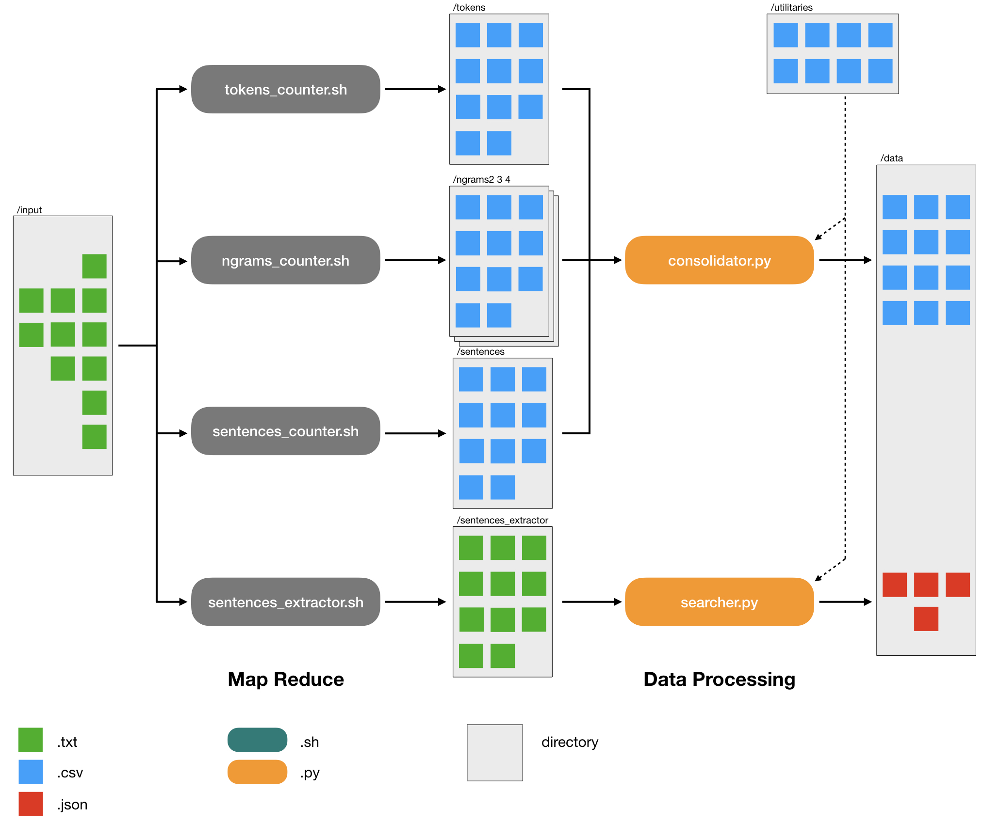
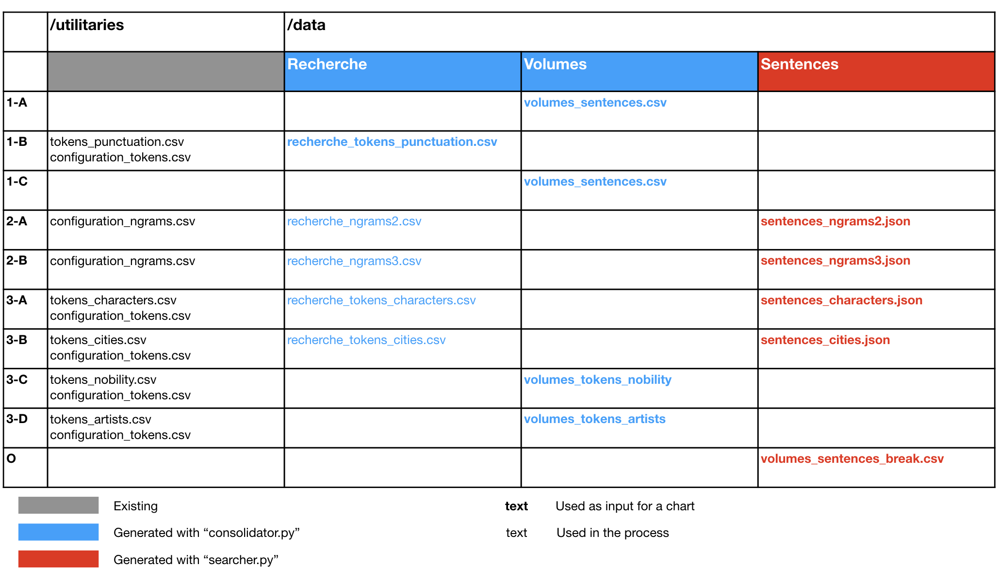

# vis-proust

**Marcel Proust** wrote **"À la recherche du temps perdu"** ("In Search of the Lost Time") between 1906 and 1922. It is considered to be one of the master-pieces of the French Litterature. The text spans over seven volumes and thousands of pages. Being an admirer of the book, I decided do some statistics around its structure and content using **Python** for the data processing and **Observable** for the presentation of the results.

Available in this repository:
- Python Map / Reduce code to do the extraction of text features
- Python code relying on pandas to do the data crunching
- Package functions tests written with Pytest
- The source CSV data and the refined CSV files feeding the notebook

## Architecture

Here is the architecture of the worflow that is used, from the initial text files to the inputs for Observable.

<p align="center">
  
</p>

## Setup

All the following commands must be run from the root of the directory. They are design to create a virtual environment, install packages and setup the structure of the work directory.

To create the virtual environment run :

```console
$ virtualenv -p python3 proust_env
```

To access it run :

```console
$ source proust_env/bin/activate
```

The install the required packages with the requirements :

```console
$ pip3 install -r requirements.txt
```

Make the setup file executable and run it in order to setup the directory structure.

```console
$ chmod 755 setup.sh
$ ./setup.sh
```


## Usage

### 1 - Map Reduce

A map reduce type of architecture is used in order to manage the text files. This architecture generates intermediary files feeding the data processing.

To generate the text outputs for tokens, ngrams, sentences in the case of count, run the following:

```console
$ ./tokens_counter.sh
$ ./ngrams_counter.sh 2
$ ./ngrams_counter.sh 3
$ ./sentences_counter.sh
```

To generate the sentences of the text, run:

```console
$ ./sentences_extractor.sh
```

### 2 - Data Processing

The data processing generates the final data files serving as inputs for the visualizations.

In order to use the consolidator in all the cases run:

```console
$ python3 consolidator.py --case tokens
$ python3 consolidator.py --case ngrams2
$ python3 consolidator.py --case ngrams3
$ python3 consolidator.py --case sentences
```

In order to use the searcher in all the cases run:

```console
$ python3 searcher.py --case ngrams2
$ python3 searcher.py --case ngrams3
$ python3 searcher.py --case tokens_characters
$ python3 searcher.py --case tokens_cities
```

## Observable Inputs

Here are the tables appearing in the workflow.

<p align="center">
  
</p>
